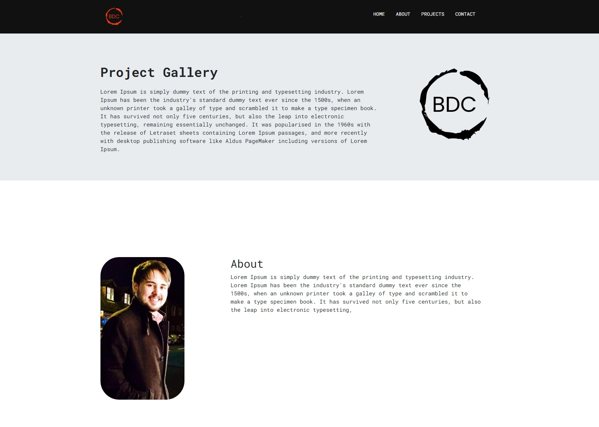

# Bootstrap-Portfolio

The task was to create a portfolio of my work as a student while using Bootstrap.

## The Goal

The objective was to recreate our previously created Project-Gallery in Bootstrap. 

The end product needed to include:
    - A nav bar
    - A bootstrap nav menu
    - A section showing a picture or avatar and my name
    - A grid showing my projects
    - A link to any deployed applications

We needed to show understanding of minimizing media queries to complete our tasks. 

## Usage

To view the project, please follow the links below:

https://bcott93.github.io/Bootstrap-Portfolio/

### Credits:

- [w3schools]
- [Javascript tutorial]
- [Bootstrap Documentation](https://getbootstrap.com/docs/4.0/getting-started/introduction/)
- [Github Pages Guide](https://pages.github.com/)

### License

Please see the License in the Repo.

